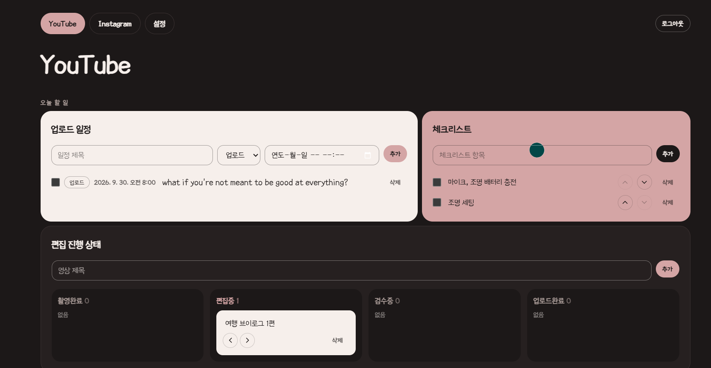
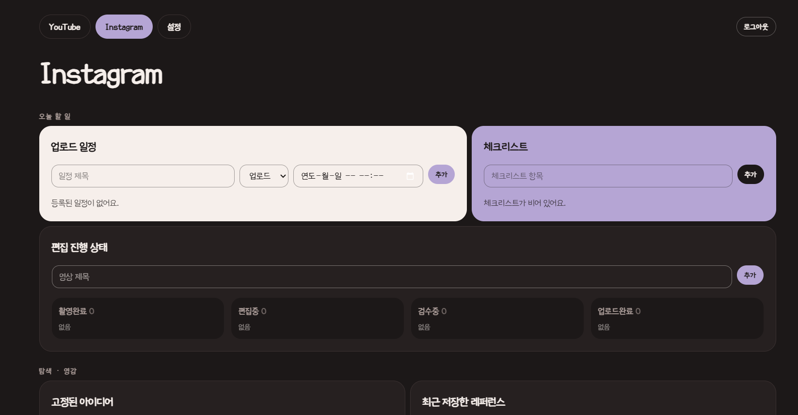
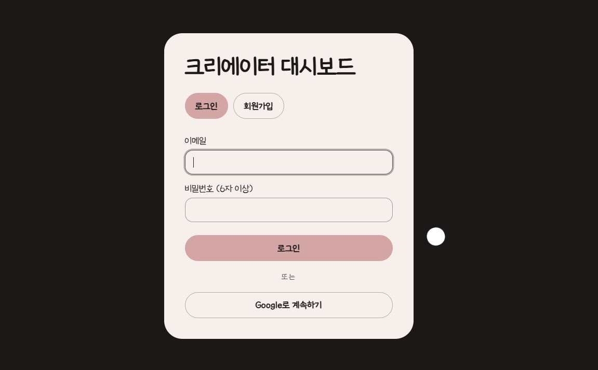

# 크리에이터 대시보드

유튜브·인스타그램 크리에이터를 위한 올인원 대시보드. 촬영·편집·업로드 일정, 아이디어, 레퍼런스, 해시태그를 한 화면의 벤토 그리드에서 관리하고, 내 니치에 맞는 YouTube 트렌드 영상을 매일 추천받는다.

**🔗 배포:** https://content-dashboard1.vercel.app

<p align="center">
  
</p>

<table>
  <tr>
    <td width="50%"></td>
    <td width="50%"></td>
  </tr>
  <tr>
    <td align="center">Instagram 워크스페이스 (더스티 라벤더)</td>
    <td align="center">로그인</td>
  </tr>
</table>

## 주요 기능

### 워크스페이스
- **YouTube / Instagram 워크스페이스** 전환 — 탭을 바꾸면 데이터와 포인트 색(더스티 로즈 ↔ 더스티 라벤더)이 함께 바뀐다.
- **한국어 / English** UI 전환, 이메일·비밀번호 및 구글 로그인.

### 오늘 할 일
- **업로드 일정** — 촬영·편집·업로드 일정과 완료 체크
- **체크리스트** — 순서 변경, 인라인 수정
- **편집 진행 상태** — 촬영완료 → 편집중 → 검수중 → 업로드완료 칸반

### 탐색 · 영감
- **오늘의 트렌드 추천** (YouTube)
  - 📺 **벤치마킹 채널** — 등록한 채널의 최근 30일 인기 영상 (채널당 최대 2개)
  - 🔍 **키워드 추천** — 그룹별 키워드 풀(최대 100개)을 매일 로테이션해 OR 검색
  - 제목·태그·설명에 겹치는 키워드 수로 **관련도 순위**를 매기고, 맞은 키워드를 태그로 표시
  - 3분 이하 숏츠와 니치 밖 카테고리는 제외, 마음에 드는 영상은 아이디어로 **고정**
- **고정된 아이디어 · 레퍼런스 · 해시태그 뱅크 · 빠른 메모**

### 사용 경험
- **즉시 반영 + 실시간 동기화** — 입력은 바로 화면에 반영되고 실패하면 되돌아가며, 다른 탭·기기에도 새로고침 없이 반영된다.
- **자동 저장** — 메모와 인라인 수정은 입력을 멈추면 저장된다.
- **마그네틱 커서** — 탭과 버튼에 커서를 대면 커서가 버튼 모양으로 감싸고 버튼이 살짝 끌려온다 (터치 기기·동작 줄이기 설정에서는 꺼짐).

## 기술 스택

| 영역 | 사용 |
|---|---|
| 프레임워크 | Next.js 16 (App Router, `proxy.ts`), React 19, TypeScript |
| 스타일 | Tailwind CSS 4 (`@theme` 토큰), lucide-react, 세종글꽃체 |
| 백엔드 | Supabase — Postgres + RLS, Auth, Realtime |
| 외부 API | YouTube Data API v3 |
| 기타 | next-intl (ko/en), zod, gsap (마그네틱 커서) |
| 테스트 | Vitest (127개) |
| 배포 | Vercel |

## 시작하기

### 준비물 (모두 무료)

| 항목 | 용도 |
|---|---|
| Node.js 22.12 이상 (권장 24) | 개발 서버 |
| Supabase 프로젝트 (무료 플랜) | DB, 로그인, 실시간 동기화 |
| Google Cloud 프로젝트 | YouTube Data API 키, 구글 로그인 |

### 1. Supabase 설정

1. [supabase.com](https://supabase.com)에서 새 프로젝트를 만든다.
2. **SQL Editor**에서 마이그레이션을 **순서대로 한 번씩** 실행한다.
   1. `supabase/migrations/0001_init.sql`
   2. `supabase/migrations/0002_trend_sources.sql`
   3. `supabase/migrations/0003_keyword_pool.sql`

   이미 운영 중인 프로젝트를 업데이트할 때는 새 코드를 배포하기 **전에** 새 마이그레이션을 먼저 실행한다. 순서가 바뀌면 실시간 동기화와 트렌드 조회가 실패한다.
3. `supabase/tests/rls_check.sql`을 실행해 결과가 `RLS OK`인지 확인한다.
4. **Authentication → URL Configuration**
   - Site URL: `http://localhost:3000` (배포 후에는 배포 주소)
   - Redirect URLs: `http://localhost:3000/auth/callback` (배포 후 `https://<배포 주소>/auth/callback` 추가)
5. **Project Settings → API**에서 Project URL과 anon(public) key를 복사해 둔다.

### 2. YouTube Data API 키

1. [Google Cloud Console](https://console.cloud.google.com/)에서 프로젝트를 만든다.
2. **APIs & Services → Library**에서 "YouTube Data API v3"를 사용 설정한다.
3. **APIs & Services → Credentials → Create credentials → API key**로 키를 만든다.
4. 키 제한(API restrictions)을 "YouTube Data API v3"로 걸어 둔다.

하루 무료 할당량은 10,000 units. 트렌드를 한 번 가져올 때 약 430 units를 쓴다 (가장 오래 쓰지 않은 키워드 그룹 4개 × 검색 100 units + 벤치마킹 채널 최대 10개 + 영상 상세 조회). "오늘 트렌드 다시 가져오기"도 한 번에 같은 양을 쓴다. 결제 정보는 필요 없다.

### 3. 구글 로그인 (선택)

1. Google Cloud Console → **APIs & Services → OAuth consent screen**을 설정한다 (External, 테스트 사용자에 본인 이메일 추가).
2. **Credentials → Create credentials → OAuth client ID** → Web application
   - Authorized redirect URIs: `https://<프로젝트-ref>.supabase.co/auth/v1/callback`
     (Supabase의 Authentication → Sign In / Providers → Google 화면에 정확한 주소가 표시된다)
3. 발급된 Client ID와 Client Secret을 Supabase의 Google provider에 입력하고 활성화한다.

### 4. 로컬 실행

```bash
cp .env.example .env.local   # 값 세 개를 채운다
npm install
npm run dev
```

http://localhost:3000 → 회원가입 → YouTube 대시보드.

| 환경변수 | 설명 |
|---|---|
| `NEXT_PUBLIC_SUPABASE_URL` | Supabase Project URL |
| `NEXT_PUBLIC_SUPABASE_ANON_KEY` | Supabase anon(public) key |
| `YOUTUBE_API_KEY` | YouTube Data API 키 (서버 전용, 절대 공개하지 않는다) |

### 5. Vercel 배포

1. Vercel에서 이 GitHub 저장소를 Import 한다 (Framework: Next.js).
2. **Environment Variables**에 위 세 값을 넣는다 (Production and Preview). `YOUTUBE_API_KEY`는 Sensitive로 표시한다.
3. 배포 후 Supabase의 Site URL과 Redirect URLs에 배포 주소를 추가한다 (1-4 참고).
4. 이후 `main`에 push하면 자동으로 다시 배포된다.

### 폰에서 테스트하기 (로컬)

1. PC와 폰을 같은 Wi-Fi에 연결하고 `npm run dev -- -H 0.0.0.0`으로 실행한다.
2. 폰 브라우저에서 `http://<PC의 내부 IP>:3000`으로 접속한다 (Windows: `ipconfig`).
3. Supabase Redirect URLs에 `http://<PC의 내부 IP>:3000/auth/callback`을 추가한다.
4. `next.config.ts`의 `allowedDevOrigins` 주석을 풀고 **PC의 내부 IP**를 넣는다 (Next.js 16 개발 서버는 localhost가 아닌 주소의 HMR 요청을 막는다. 커밋하지 않아도 된다).
5. 이메일 확인 링크는 Site URL을 가리키므로 **회원가입과 이메일 확인은 PC에서** 하고, 폰에서는 **로그인만** 한다.

## 명령어

| 명령 | 설명 |
|---|---|
| `npm run dev` | 개발 서버 |
| `npm test` | 단위 테스트 (Vitest) |
| `npm run typecheck` | 타입 체크 |
| `npm run lint` | ESLint |
| `npm run build` | 프로덕션 빌드 |

## 프로젝트 구조

```
src/
  app/                 # 라우트 (로그인, /youtube, /instagram, 설정, 인증 콜백)
  components/ui/       # Card, Button, PillTabs, Tag, 필드, 마그네틱 커서
  features/            # 위젯별 UI + 데이터 (schedule, checklist, kanban, trends …)
  lib/
    realtime/          # 낙관적 업데이트, Realtime 구독, 자동 저장
    trends/            # 로테이션, OR 검색어, 관련도 점수, 4+4 합치기
    youtube/           # YouTube API 호출 (가짜 fetch로 테스트)
  i18n/                # next-intl 설정, 언어 저장
messages/              # ko.json / en.json
supabase/              # 마이그레이션, RLS 검증 스크립트
docs/superpowers/      # 설계 스펙과 구현 계획
```

설계 문서는 [`docs/superpowers/specs`](docs/superpowers/specs), 구현 계획은 [`docs/superpowers/plans`](docs/superpowers/plans)에 있다.

## 글꼴 라이선스

한글·영문 글꼴은 **세종글꽃체**(`src/app/fonts/SejongGeulggot.ttf`)를 사용한다.

- 저작권: 세종특별자치시 (공공저작물, 문화체육관광부 「공공저작물 저작권 관리 및 이용 지침」에 따라 무료 사용)
- 조건: 유료 양도·판매 금지, 변형 재배포 금지 → 이 저장소에는 **받은 원본 TTF를 수정 없이** 포함한다 (형식 변환·서브셋 금지).
- 출처 표시: 누리집 사용 시 저작권자를 밝혀야 하므로 모든 화면 하단에 "이 사이트는 세종특별자치시의 세종글꽃체를 사용합니다."를 표시한다.
- 참고: https://noonnu.cc/font_page/1523
